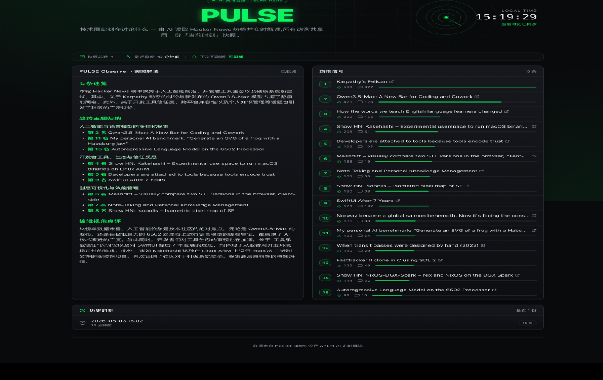
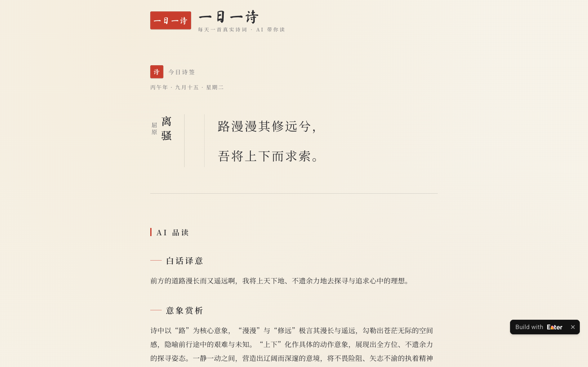
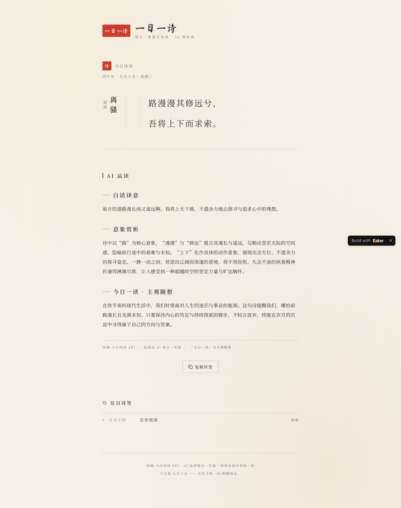
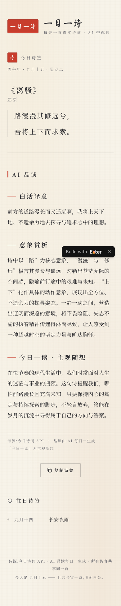

# enter-examples

> 🌐 **English version** → [README.en.md](README.en.md)

  

  <strong>真实上线、点开就玩的 Enter 作品陈列室——每个作品附 prompt 原文与逐轮验证记录</strong>

  
  
  
  

在 [Enter](https://enter.converge.ai)(AI 应用构建平台)上、由 agent 按 [enter-skills](https://github.com/convergeai-labs/enter-skills) playbook 驱动 Enter 创作的示例作品。每个条目都附带完整故事、截图、prompt 原文与 provenance 记录。

**同一个 agent、同一套 playbook,能产出多不同的网站?**——这是本陈列室的核心实验:

| 电子霓虹 · 实时雷达 | 宣纸朱砂 · 编辑美学 |
|---|---|
|  |  |
| **PULSE**:AI 流式解读技术圈此刻 | **一日一诗**:每天一首诗,AI 带你读 |

两件作品都是零输入、首屏即内容、全访客共享状态、生产环境真实运行——**风格的跨度就是工作流自由度的证据**。

---

## 🛰️ PULSE — AI 实时观测站

  

一个「24 小时活着」的技术雷达:AI 流式解读 Hacker News / GitHub **此刻**的讨论,所有访客共享同一个「当前时刻」;排名动量徽章追踪榜单变化;Agent 自主挑选 3 条新闻并用真实抓取的内容做深潜解读;每周自动生成技术周报,一键复制 Markdown 即可分享到团队周报渠道。

**▶ 在线预览**:[PULSE — AI 实时观测站](https://d41c8754b3a14836980c67b0acfcddfa.prod.enterapp.pro/)(已发布 prod;打开即当前共享快照,每 15 分钟最多重新生成一次)

零输入,首屏即内容。3 天 7 个有界批次构建完成,每个批次都在 Enter 之外独立验证——包括数据库直查与系统剪贴板读回。

| | |
|---|---|
|  |  |
| 三源雷达 + 动量徽章 | 每周技术周报 + 复制 Markdown |

### 它是怎么被 agent 造出来的

  

契约先行 → 一个富创建 prompt → 七个内聚批次(每批携带上一轮已验证基线作为不变量)→ 每批独立复验。Enter 负责执行,agent 负责规划与验证——Enter 的回执只是 claim,证据全部来自 Enter 之外的泳道。

📖 **完整故事 + agent 创作方法**:[entries/2026-08-pulse-ai-observatory/](entries/2026-08-pulse-ai-observatory/)
🛠 **方法论 skill**:[enter-project-ops](https://github.com/convergeai-labs/enter-skills/blob/main/skills/enter-project-ops/SKILL.md)

---

## 🏮 一日一诗 · Daily Verse — AI 诗词品读站

  

与 PULSE 的电子霓虹风**刻意对立**的第二件作品:宣纸暖白、墨色衬线、朱砂印章、竖排诗题——编辑/出版美学。每天一首真实诗词,AI 三段式品读(白话译意 / 意象赏析 / 今日一读),所有访客共享同一首「今日之诗」;按天幂等,LLM 每天最多调用一次,不用 cron。

**▶ 在线访问**:[一日一诗 · Daily Verse](https://92346ae03f4c440fb435995a5c68f861.prod.enterapp.pro/)(已发布 prod;打开即今日诗签,每日 UTC+8 首访生成)

零输入,首屏即诗。跨天行为在生产环境实测:零点过后首位访客自动触发次日新诗,昨日诗签归档可点读。诚实性写进契约:API 无朝代字段就留空不虚构,首日历史如实空态,「今日一读」明确标注主观随想。

| | |
|---|---|
|  |  |
| 移动端 390:竖排→横排降级 | 桌面 1440:编辑/出版美学 |

📖 **完整故事 + agent 创作方法**:[entries/2026-09-daily-verse-editorial-site/](entries/2026-09-daily-verse-editorial-site/)

---

## 条目索引

| 条目 | 类型 | 一句话 |
|---|---|---|
| [2026-08-pulse-ai-observatory](entries/2026-08-pulse-ai-observatory/) | 实时 AI 技术雷达 | 零输入观测站:流式解读、三源雷达、动量徽章、Agent 深潜、每周周报——7 个已验证批次 |
| [2026-09-daily-verse-editorial-site](entries/2026-09-daily-verse-editorial-site/) | AI 诗词品读站 | 编辑/出版美学的一日一诗:按天幂等、诚实降级、复制诗签——风格跨度的实证 |

## 🍳 把作品复刻到你自己的 Enter

每个作品都有**可直接粘贴的配方 prompt + 会碰到的 gate + 可调旋钮**:[recipes/](recipes/)。一日一诗是 ★ 难度(单 prompt 一次构建),适合第一次上手;PULSE 是 ★★★(创建 + 7 批次),适合想看完整工程节奏的人。

更多条目筹备中——每个新的 Enter 作品都会带着它的 prompt 与 provenance 落到这里。
