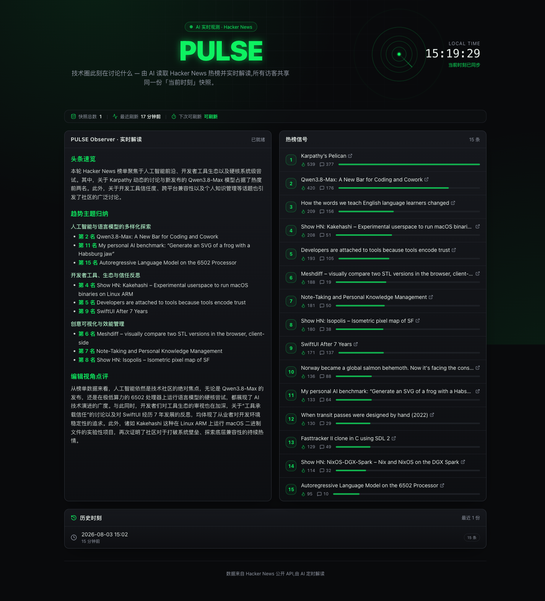
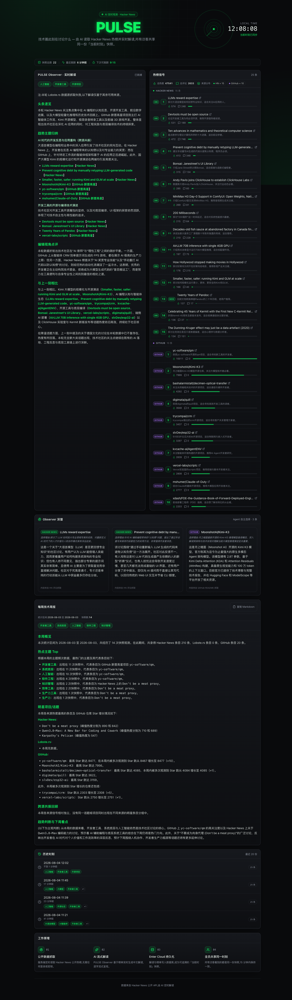
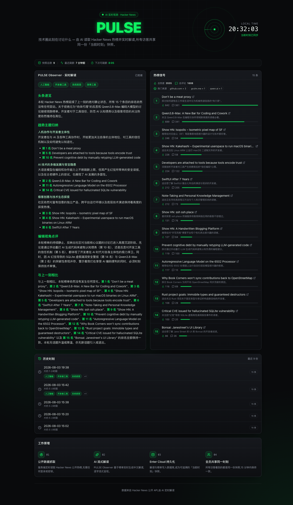
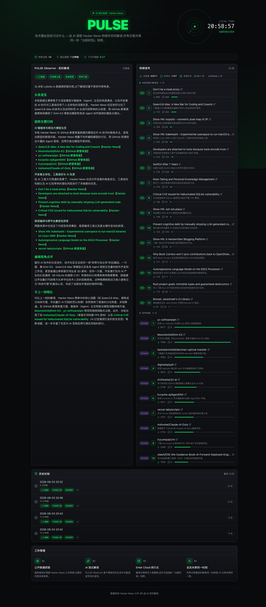
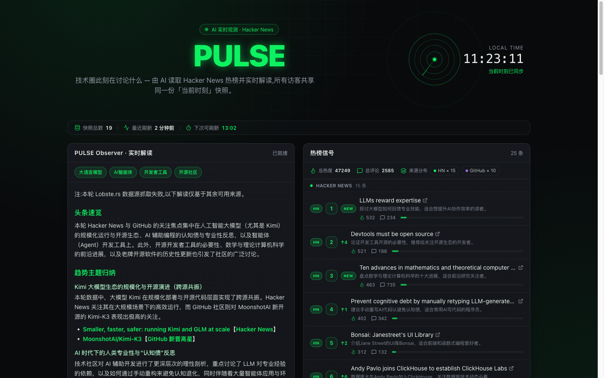
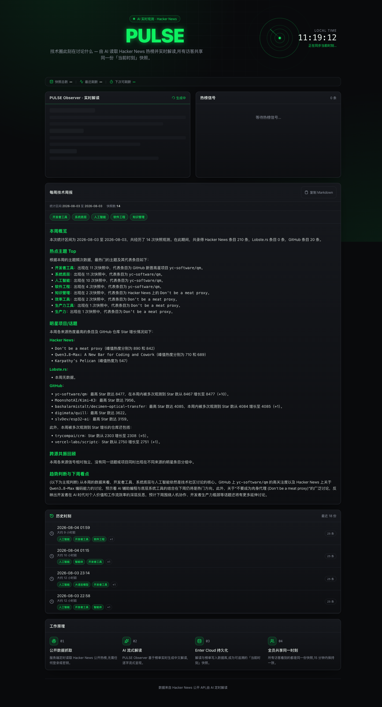

# PULSE — AI 实时观测站

> 🌐 **English version** → [README.en.md](README.en.md)

**在线预览**:https://d41c8754b3a14836980c67b0acfcddfa.prod.enterapp.pro/(已发布 prod 正式地址)

一个「24 小时活着」的技术圈观测仪表盘,完全在 [Enter](https://enter.converge.ai) 上构建——由一个 AI agent 驱动 Enter 的 AI agent 完成。零输入,首屏即内容:AI 解读技术圈**此刻**在讨论什么,所有访客共享同一个「当前时刻」。

## 它能做什么

- **实时 AI 解读**——PULSE Observer 流式输出四段式中文解读(头条速览 → 趋势主题归纳 → 编辑视角点评 → 「与上一刻相比」)
- **三源雷达**——Hacker News 热榜、GitHub 新晋高星、DEV.to 日榜;分组展示带来源徽章,同一话题真实出现在多个源时点名「跨源共振」
- **排名动量**——每条携带 ↑n / ↓n / NEW 徽章,服务端与上一份快照对比计算
- **条目一句话点评**——同一次生成调用为全部 35 条条目输出中文点评(仅按标题推断,禁止虚构)
- **Observer 深潜**——真正的工具使用 Agent 循环:Observer **自主选择**最多 3 条值得深潜的条目,后端**抓取**它们的 HN 评论 / GitHub README,再**基于真实内容**写解读——每张卡片标注内容来源
- **每周技术周报**——每周把整周快照聚合成结构化周报(主题频次 Top、明星项目真实 Star 增长、跨源回顾、趋势判断),一键**复制 Markdown** 直接粘贴到团队周报分享渠道
- **共享世界状态**——快照 public read / service-role write;刷新页面、换浏览器,看到的是同一个时刻。全局 15 分钟原子锁控制生成成本,无需 cron

## 如何用 agent + skill 创作(指导叙事)

由 Claude Code 按 [enter-project-ops](https://github.com/convergeai-labs/enter-skills) skill 驱动 Enter 构建。分工:**Claude 规划与验证,Enter 执行。**

1. **契约先行**——本地 goal 文件先固定概念、能力展示清单、护栏(未授权不发布、密钥只在服务端、只用公开数据、15 分钟锁),并作为 run log 全程更新。
2. **一个富创建 prompt**([prompts/](prompts/))——概念、数据源、惰性刷新成本模型、存储 + RLS 语义、页面结构、约束,一次说清。Enter 出计划、过模型/云/AI 三道 gate,然后构建:边缘函数 + 两张表 + 流式 UI。
3. **七个有界批次,一批一主题**——内容丰富化 → 榜单雷达化(点评+动量)→ 多数据源 → 每周周报 → Agent 工具化深潜 → 换源(DEV.to 替换不可达的 Lobste.rs)。每批 prompt 携带上一轮**已验证**的基线作为不变量,外加明确排除项(明天的范围今天排除)。
4. **每批独立复验**——Enter 的回执是 claim。每轮都从外部证明:三档视口新鲜预览、console/网络健康,以及最强泳道——**用公开 anon key 直查数据库**(行数、新列、计算字段)。复制按钮用系统剪贴板(`pbpaste`)读回并与 DB 原文逐字比对。动量徽章与跨源共振是次日上午真实换榜时被现场目击的。
5. **平台怪癖生存**——任务流停滞(重载编辑器 URL 重同步)、边缘函数部署传播延迟(调试标记定位后清除)、以及一个 Enter 构建中自诊自修的 PostgREST `.or()` 锁认领 bug。

### 诚实性(为什么可信)

- 数据源 Lobste.rs 在边缘函数网络长期不可达:建站首周每轮解读开头如实注明缺源、用其余源正常交付(降级是设计的一部分,生产环境真实发生),随后在第 7 批次被整体替换为 DEV.to——换源后三源全部真实在线。
- 某周没有跨源重合时,周报如实写「各来源信号相对独立」,不编造共振。
- 排名不变(delta=0)就不显示徽章——没有噪音才是正确行为。

## 图集

| | |
|---|---|
|  |  |
| 条目一句话点评(批次 A) | 三源分组 + 来源徽章(批次 B) |
|  |  |
| ↑/NEW 徽章隔夜实战(批次 A 证据) | 每周技术周报 + 复制 Markdown(批次 C) |

移动端(327–390px,零横向溢出):[07-mobile.png](screenshots/07-mobile.png)

## Provenance

逐轮完整记录与验证证据:[provenance.md](provenance.md)。代表性 prompt 原文:[prompts/](prompts/)。
